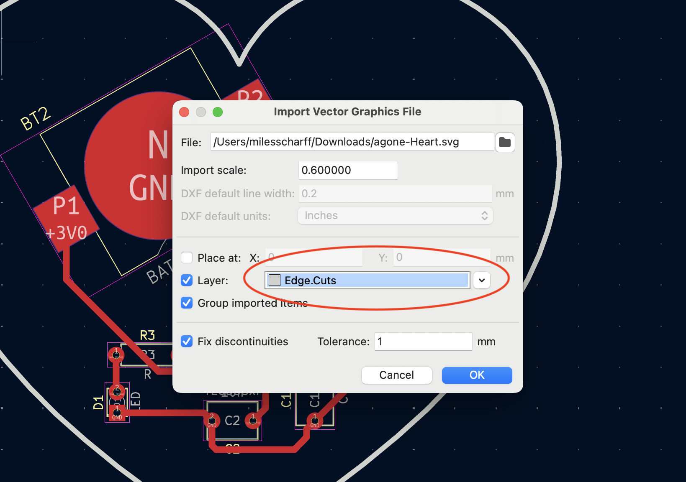

# PCB-Milling-Project-for-Creative-Embedded-Systems
Files and steps for completion of the PCB Milling Assignment

# Step 1: KiCAD PCB Layout

Please download the 555timerCES folder to begin this step of the assignemnt. 

To complete this step, you must arrange and route connections between the components of the 555 timer LED flasher circuit inside KiCAD's PCB editor. There are three tutorial videos for this section. The first move through the whole process in detail and also gives context for the layout process in reference to the milling and assembly portion of this assignment. The second video is much shorter and runs through the process with little explanation. It is meant to be watched after the first video and to be a reference as you're doing the assignment. The third is an optional tutorial on more flexible custom board outlines imported from the internet or made yourself in programs like Inkscape.

Detailed tutorial:

Reference tutorial:

Additional tutorial for custom board outlines (SEE CORRECTION AFTER THIS VIDEO):

CORRECTION TO PREVIOUS VIDEO: I neglected to say that when you're importing you custom board outline .svg file, you must select the layer as "Edge.cuts" in the same pop-up window as you set the scaling. I left the layer as "User.drawings". Please see the image below on where to select the layer.

# Step 2: Convert KiCAD Gerber and Drill Files to CNC Friendly SVGs

# Step 3: Mill Your PCB On The Carvey CNC
